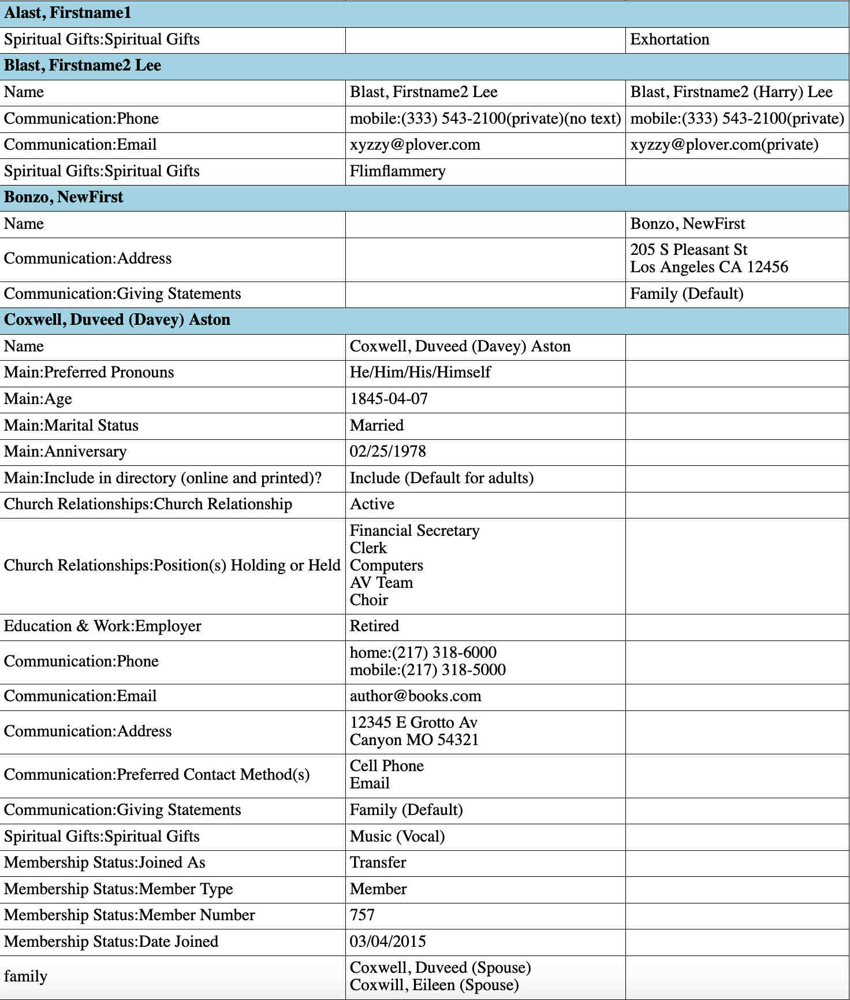

============================
Breeze Email Reports Details
============================

Here's documentations for the utilities in this package. (There's only one currently. Others may be forthcoming.)

-----------------
Table of Contents
-----------------

* `Email Profile Report`_
    * `Report Formats`_
        * `HTML Format`_
        * `Text Format`_
        * `CSV Format`_

* `Configuring Dependent Packages`_
    * `Platformdirs`_
    * `Configured Mail Sender`_
    * `Breeze CHMS API`_
* `Configuring the Utilities`_
    * `Email Profile Report Command`_
* `Automatically Running Commands`_

--------------------
Email Profile Report
--------------------

The ``email_profile_report`` utility emails a report of changes to your Breeze profile data between runs.
Ir can send its report in three formats:

* HTML (default) - This is the most readable format.
* Text - An alternative to HTML, this is simple text. This is usable if
  recipients don't use an email reader that supports HTML, but it presumes
  a constant-width font, which many readers don't assume.
* csv - As an alternative, the report can be sent as a CSV attachment suitable
  for importing into applications such as spreadsheets.

Samples of all formats are included below.

On each run, it download's the current profile field schema and all current members'
profiles from Breeze and uses them to extract each member's profile data. It compares
the current members' fields against those saved in a previous run and creates a
report of what changed. It then saves the current information to be used in a next run.

The command is issued as:

::

    email_profile_report [options]

with any of the following options:

--from sender
  This is the sending email address for the report. With a couple of exceptions
  when no report is sent, this is required.
--to receivers
  List email recipients, comma separated. You must specify at least --to or --bcc. Both are allowed.
--bcc receivers
  List of blind receivers
--format <html, text, or csv>
  Format of the report. Default is html.
--data <path to directory>
  Directory where history is saved, if not the default. (See configuration information below.)
--reference_data <path to file>
  Special case, use this file to compare against current data from Breeze instead of data from the most recent run.
--columns <w1,w2,w3>
  For text format only, widths of the three columns in characters. Default is 30,20,20.
--breeze_creds <path to Breeze credentials file>
  Your Breeze credentials with url and API key aren't in the standard place.
--email_creds <path to email credentials>
  File with your email credentials (mostly passwords) if not in the standard place.
--email_servers <path to file with email server configuration>
  File with information about your email domain server if not in the standard place.
--replay
  This tells the command to email the report on the two most recent saved database state
  instead of the most recent and current data loaded from Breeze. Use this if you want
  to send the report in different forms to different recipients. (Run once without
  --replay, then others with --replay.)
--list_directories
  This prints the directories on your system where data and configuration files are
  found. This may be useful if you don't know where files go on your system.
--initialize
  Use this before your first run. It reads your current profile data from
  Breeze and saves it as the current profile data. This will be used as
  the reference data for the first "real" report.

The report has a section for each member profile that had changes.
First there's a row with the member name. This followed by a row for
each field that had changes. Each row has three columns:

* The field name
* Any values in the reference (previously saved data) that were removed removed in the current data
* Any values in the current data that weren't in the previous

Note that some fields can have multiple values. Any values that didn't change won't
be in the report, only those that were added, removed, or changed.

++++++++++++++
Report Formats
++++++++++++++

!!!!!!!!!!!
HTML Format
!!!!!!!!!!!

The default HTML format looks like this (generated from test data).

!!!!!!!!!!!
Text Format
!!!!!!!!!!!

Text format for the same data appears thus::

    Alast, Firstname1
       |------------------------------|--------------------|--------------------|
       |Spiritual Gifts:              |                    |Exhortation         |
       |+Spiritual Gifts              |                    |                    |
       |------------------------------|--------------------|--------------------|

    Blast, Firstname2 Lee
       |------------------------------|--------------------|--------------------|
       |Name                          |Blast, Firstname2   |Blast, Firstname2   |
       |                              |+Lee                |+(Harry) Lee        |
       |------------------------------|--------------------|--------------------|
       |Communication:Phone           |mobile:             |mobile:             |
       |                              |+(333)              |+(333)              |
       |                              |+543-2100(private)(n|+543-2100(private)  |
       |                              |+o text)            |                    |
       |------------------------------|--------------------|--------------------|
       |Communication:Email           |xyzzy@plover.com    |xyzzy@plover.com(pri|
       |                              |                    |+vate)              |
       |------------------------------|--------------------|--------------------|
       |Spiritual Gifts:              |Flimflammery        |                    |
       |+Spiritual Gifts              |                    |                    |
       |------------------------------|--------------------|--------------------|

    Bonzo, NewFirst
       |------------------------------|--------------------|--------------------|
       |Name                          |                    |Bonzo, NewFirst     |
       |------------------------------|--------------------|--------------------|
       |Communication:Address         |                    |205 S Pleasant St;  |
       |                              |                    |+Los Angeles CA     |
       |                              |                    |+12456              |
       |------------------------------|--------------------|--------------------|
       |Communication:                |                    |Family (Default)    |
       |+Giving Statements            |                    |                    |
       |------------------------------|--------------------|--------------------|

    Coxwell, Duveed (Davey) Aston
       |------------------------------|--------------------|--------------------|
       |Name                          |Coxwell, Duveed     |                    |
       |                              |+(Davey) Aston      |                    |
       |------------------------------|--------------------|--------------------|
       |Main:Preferred Pronouns       |He/Him/His/Himself  |                    |
       |------------------------------|--------------------|--------------------|
       |Main:Age                      |1845-04-07          |                    |
       |------------------------------|--------------------|--------------------|
       |Main:Marital Status           |Married             |                    |
       |------------------------------|--------------------|--------------------|
       |Main:Anniversary              |02/25/1978          |                    |
       |------------------------------|--------------------|--------------------|
       |Main:                         |Include (Default    |                    |
       |+Include in directory (online |+for adults)        |                    |
       |+and printed)?                |                    |                    |
       |------------------------------|--------------------|--------------------|
       |Church Relationships:         |Active              |                    |
       |+Church Relationship          |                    |                    |
       |------------------------------|--------------------|--------------------|
       |Church Relationships:         |AV Team             |                    |
       |+Position(s) Holding or Held  |Choir               |                    |
       |                              |Clerk               |                    |
       |                              |Computers           |                    |
       |                              |Financial Secretary |                    |
       |------------------------------|--------------------|--------------------|
       |Education & Work:Employer     |Retired             |                    |
       |------------------------------|--------------------|--------------------|
       |Communication:Phone           |home:(217) 318-6000 |                    |
       |                              |mobile:             |                    |
       |                              |+(217) 318-5000     |                    |
       |------------------------------|--------------------|--------------------|
       |Communication:Email           |author@books.com    |                    |
       |------------------------------|--------------------|--------------------|
       |Communication:Address         |12345 E Grotto Av;  |                    |
       |                              |+Canyon MO 54321    |                    |
       |------------------------------|--------------------|--------------------|
       |Communication:                |Cell Phone          |                    |
       |+Preferred Contact Method(s)  |Email               |                    |
       |------------------------------|--------------------|--------------------|
       |Communication:                |Family (Default)    |                    |
       |+Giving Statements            |                    |                    |
       |------------------------------|--------------------|--------------------|
       |Spiritual Gifts:              |Music (Vocal)       |                    |
       |+Spiritual Gifts              |                    |                    |
       |------------------------------|--------------------|--------------------|
       |Membership Status:Joined As   |Transfer            |                    |
       |------------------------------|--------------------|--------------------|
       |Membership Status:Member Type |Member              |                    |
       |------------------------------|--------------------|--------------------|
       |Membership Status:            |757                 |                    |
       |+Member Number                |                    |                    |
       |------------------------------|--------------------|--------------------|
       |Membership Status:Date Joined |03/04/2015          |                    |
       |------------------------------|--------------------|--------------------|
       |family                        |Coxwell, Duveed     |                    |
       |                              |+(Spouse)           |                    |
       |                              |Coxwill, Eileen     |                    |
       |                              |+(Spouse)           |                    |
       |------------------------------|--------------------|--------------------|

!!!!!!!!!!
CSV Format
!!!!!!!!!!
And the csv attachment thus::

    "Alast, Firstname1"
    ,Spiritual Gifts:Spiritual Gifts,,Exhortation
    "Blast, Firstname2 Lee"
    ,Name,"Blast, Firstname2 Lee","Blast, Firstname2 (Harry) Lee"
    ,Communication:Phone,mobile:(333) 543-2100(private)(no text),mobile:(333) 543-2100(private)
    ,Communication:Email,xyzzy@plover.com,xyzzy@plover.com(private)
    ,Spiritual Gifts:Spiritual Gifts,Flimflammery,
    "Bonzo, NewFirst"
    ,Name,,"Bonzo, NewFirst"
    ,Communication:Address,,205 S Pleasant St;Los Angeles CA 12456
    ,Communication:Giving Statements,,Family (Default)
    "Coxwell, Duveed (Davey) Aston"
    ,Name,"Coxwell, Duveed (Davey) Aston",
    ,Main:Preferred Pronouns,He/Him/His/Himself,
    ,Main:Age,1845-04-07,
    ,Main:Marital Status,Married,
    ,Main:Anniversary,02/25/1978,
    ,Main:Include in directory (online and printed)?,Include (Default for adults),
    ,Church Relationships:Church Relationship,Active,
    ,Church Relationships:Position(s) Holding or Held,AV Team,
    ,,Choir,
    ,,Clerk,
    ,,Computers,
    ,,Financial Secretary,
    ,Education & Work:Employer,Retired,
    ,Communication:Phone,home:(217) 318-6000,
    ,,mobile:(217) 318-5000,
    ,Communication:Email,author@books.com,
    ,Communication:Address,12345 E Grotto Av;Canyon MO 54321,
    ,Communication:Preferred Contact Method(s),Cell Phone,
    ,,Email,
    ,Communication:Giving Statements,Family (Default),
    ,Spiritual Gifts:Spiritual Gifts,Music (Vocal),
    ,Membership Status:Joined As,Transfer,
    ,Membership Status:Member Type,Member,
    ,Membership Status:Member Number,757,
    ,Membership Status:Date Joined,03/04/2015,
    ,family,"Coxwell, Duveed (Spouse)",
    ,,"Coxwill, Eileen (Spouse)",

------------------------------
Configuring Dependent Packages
------------------------------
The utilities in this package store historical data between runs, and a number
of packages they depend on for proper operation need to load configuration
files for their proper operation.

* ``breeze_profile_report`` saves its historical profile data between runs.
* The required module configured_mail_sender_, the module that actually
  sends emails, uses configuration files to determine how to connect to the
  sending domain's outgoing email servers, and to get the passwords needed to
  authenticate the user with the servers.
* The required module breeze_chms_api_ needs the url and API key necessary
  to connect to your Breeze instance.

.. _configured_mail_sender: https://pypi.org/project/configured-mail-sender/
.. _breeze_chms_api: https://pypi.org/project/breeze-chms-api/
The "standard" location for configuration files depends on the platform
you're running on. The normal location for configuration files is different
between Windows, MacOS, and Linux. (And maybe others.) All of these modules
depend on the platformdirs_ module to learn where it should look for
various files.

.. _platformdirs: https://pypi.org/project/platformdirs/

You should see the documentation for each package for more complete
information about how to configure each, but the following sections
should give you enough detail to make things work.

++++++++++++
Platformdirs
++++++++++++
The platformdirs_ package defines where user and system configuration
and data files are normally stored on various platforms. The package defines
many directories for different purposes. Consult the package documentation
for details, but for convenience the directories on the most popular platforms for
directories used by breeze_email_reports are reproduced here. Subsequent
sections describe where these directories are used.

Three different cases are used by ``email_profile_report`` and its required
platforms:
* user configuration directory: Where user-specific configuration files are stored.
* user data directory: Where user-specific application data is stored.
* site configuration directory: Were global site configuration information is stored.

You can look at the platformdirs_ documentation to see where these directories
are on your system, but I'm not sure that the documentation is always correct.
For convenience, if you run ``email_profile_report --list_directories`` it
will print those three directories on your particular system.

The following sections describe how the directories are used. In each case,
configurations are in a subdirectory of the main user or site configuration
directory.

++++++++++++++++++++++
Configured Mail Sender
++++++++++++++++++++++
``breeze_profile_reports`` depends on the configured_mail_sender_ package
to send the email report. To do this, it needs two key bits of information:

* The url and port needed to connect to the sending email's SMTP server.
* Credentials needed to authenticate the user with the server. This
  is at least the user's password, but can also be a user ID if it
  isn't just the outgoing email address.

configured_mail_sender_ has built-in knowledge of several common email domains,
including google.com, yahoo.com, aol.com, hotmail.com, outlook.com, and comcast.net.
If your email domain isn't known, you'll need to create a ``mailsender_domains.yml``
file in a ``MailSender`` directory under either the site or user configuration directory.
(The former is advised so the configuration can be used by others.) It will look in
both files if both are present, though the user-specific fill will override
the system one if there are conflicts.

You'll need to add an entry for each unknown email domain like this::

    myspecialdomain.org:
      server: smtp.mydomain.org
      port: <port to connect to, usually 465 or 587>

You can also tell ``email_profile_report`` to look elsewhere for this file using
the ``--email_servers`` option.

configured_mail_sender_ also looks for a ``mailsender_creds.yml`` file in a ``MailSender``
directory in the user's configuration directory. Because passwords are sensitive
(obviously), this credentials file should be readable only by the user. This file
should have an entry for each outgoing email address you might use::

    myemailaddress@yahoo.com:
      password: "myemailpassword"
      userid: login_userid # only if not myemailaddress@yahoo.com

You can tell the program to look elsewhere for your credentials with the ``--email_creds``
option.

A note: Many email providers allow you to create "single user" passwords,
special complex passwords different from the one that you usually use
to login to their site. I recommend using that if possible. If that password
gets compromised you can disable it without impacting your normal login.

+++++++++++++++
Breeze CHMS API
+++++++++++++++
The breeze_chms_api_ package provides the interface ``email_profile_reports``
to download information from your Breeze instance. For this it needs the URL
where you contact Breeze, generally ``yourchurchname.breezechms.com``. You'll
also need your church's "API Key," which is essentially the password that
the software needs to access the Breeze API. You'll have to contact Breeze
support to get that key. Guard the key carefully. Anyone with the key and
your church URL could wreck havoc with your site. You'll also want to contact
support to change the API key if is leaked.

breeze_chms_api_ looks for a ``breeze_maker.yml`` file in your user
configuration directory. (It will also look in the system configuration directory,
but that's discouraged.) The file should be readable only by the user.

The file should look like this::

    breeze_url: yourchurchname.breezechms.com # Or whatever you have
    api_key: YourApiKey

-------------------------
Configuring the Utilities
-------------------------
++++++++++++++++++++++++++++
Email Profile Report Command
++++++++++++++++++++++++++++
While packages used by ``breeze_profile_reports`` need configuration information,
the command itself does not. It does, however, store its historical
data (values from previous runs) in a ``BreezeProfiles`` subdirectory of
the user configuration directory.

This default can be overridden using the ``--data`` option to the command.

------------------------------
Automatically Running Commands
------------------------------
So now that you understand what this utility needs to do, how do you run it? While you can
run it manually from time to time, it would make sense to have it run automatically on some schedule,
say late at night on a Sunday when there probably aren't updates happening.

First, obviously, you'll need to install the Python language. It may have come preinstalled
on your system, but if so it's likely an old version. If you don't already have at least Python 3.7
installed, you should install a later version. As of this writing, 3.11 is the latest
production version. You can download Python from
`the python.org download page <https://www.python.org/downloads/>`_.

The next decision is: do you want to install this (and the dependencies)
system-wide or just your own use? If it's just you (or a few others
working on a common project), installing it on the system should be fine.
Otherwise, I'd suggest you use a
`Python virtual environment
<https://www.freecodecamp.org/news/how-to-setup-virtual-environments-in-python/>`_.
Explaining that is beyond the scope of this document, but basically it's
a complete Python environment, with its own installed packages, independent
of the system-installed packages. You can run your command in said environment.

On Unix-based systems including MacOS and Linux you can use crontab to
schedule your command to run at appropriate times. For example, I have
the script run every Sunday night at 11pm, so I have a crontab entry like this::

    0 23 * * 0 email_profile_report -f me -t people... <other settings>

If you're running the command in a virtual environment you'll need to do something
to activate the environment before running ``email_profile_report``. In that case,
this seems to work for me::

    0 23 * * 0 bash -c ". <path to your virtual environment>/bin/activate;email_profile_report <parameters>"

By the way first five symbols on that line say when to run the command, and are:

* Hour zero in the hour
* Hour 23 (11 PM)
* Any day of the month
* Any month of the year
* On day zero of the week (Sunday)

I don't "do" Windows, but it appears that it has a similar facility to
run tasks on a schedule.
